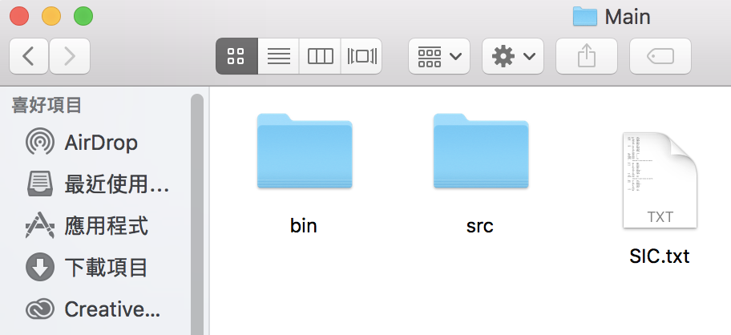
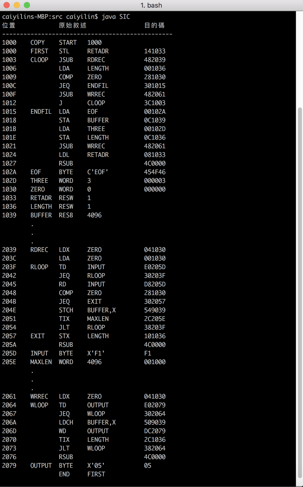

# SIC Assembler

## SIC機器架構
1. 簡化電腦指令ＳＩＣ(Simplified Instructional Computer) SIC與SIC/XE
2. 記憶體 32768 Bytes = 2^15
3. 用來表示記憶體位置之位元數為 15 bits
4. 三個連續的Bytes組成一個 Word => 24 bits
- 暫存器：（五種 每個24bits）
  - A (Accumulator) 累加器：算術運算
  - X (Index register) 索引暫存器：定址
  - L (Linkage register) 連結暫存器：跳到副程式JSUB，儲存返回位置
  - PC (Program counter) 程式計數器：儲存下一個要被執行的位置
  - SW (Status word) 狀態字組 

## 指令集
1. 載入和儲存暫存器(LDA、LDX、STA、STX)
2. 算術運算(ADD、SUB、MUL、DIV)
3. 控制(條件跳耀if)
4. 輸入輸出(I/O)

## SIC虛指令
 - START ：指定程式名稱和起始位置
 - END : 結束處並指定程式中第一個執行指令
 - BYTE : 定義字元或十六進位常數 ex: 
    - C 'EOF' = 3 (c計算引號內有多少字元)
    - X 'F1' = 1  (x固定長度1)
 - WORD : 定義一個字組的整數常數 （長度固定3）
 - RESB : 保留所示數量位元組 ex:
    - (4096)十進位＝(1000)十六進位
 - RESW : 保留所示數量字組 （乘以三）

## 轉換流程
1. 將助記碼(指令)轉乘OP-Code
    - ex: STL => 14
2. 把運算元對應到符號的位置
    - parse 1 : 計算指令位置及標籤（產生符號表）
    - parse 2 : 組譯指令產生目的碼
3. 
    - BYTE C 'EOF' => ASCii 十六進位 454F46
    - WORD 30 => 轉十六進位 00001E
    - RES 不輸出目的碼
    - BYTE X 'F1' => 直接輸出文字F1
    - RSUB 輸出OP Code且後面補滿0
    - BUFFER'X 直接加 8000

## Usage
將此專案clone下來後有兩個執行方法

方法1.
-  利用Eclipse執行
- 注意SIC.txt檔案路徑位置放置於src的上一層資料夾才能正確執行



方法2.
- 利用終端機執行

    編譯java檔產出SIC.class
  ```
  $ javac SIC.java 
  ```
    執行SIC應產出 SIC_Final.txt

  ```
  $ java SIC
  ```

- 注意SIC.txt檔案路徑位要與java放一起才能正確執行


